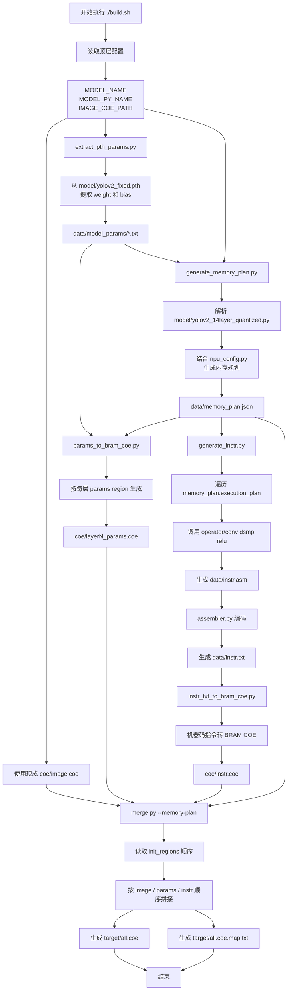

# 编译器整体运行流程说明

## 1. 文档目的

本文档介绍当前 NPU 编译器从模型、现成输入图像 COE 和权重文件出发，最终生成 FPGA BRAM 初始化文件 `target/all.coe` 的整体流程。

该编译器目前围绕量化后的 YOLOv2 模型展开，主要完成以下工作：

- 从 PyTorch `.pth` 权重文件中提取模型参数；
- 从模型 `.py` 文件中解析卷积层结构；
- 生成初始化区和运行时区的统一内存规划；
- 根据内存规划生成 NPU 汇编和机器码指令；
- 使用现成的 `coe/image.coe` 作为输入图像初始化数据；
- 将 weight/bias 参数区和 instruction 分别转换成 `.coe`；
- 按 `memory_plan.json` 中的初始化区顺序合并成最终 `target/all.coe`。

当前构建流程暂时不从 `data/image.jpg` 生成 `coe/image.coe`。`python/image_to_bram_coe.py` 仍保留在工程中，后续需要恢复图片转 COE 时可以重新启用。

当前完整构建入口为：

```bash
./build.sh
```

清理构建产物的入口为：

```bash
./build.sh clean
```

## 2. 顶层目录职责

```text
model/
```

存放模型定义和模型权重，例如：

```text
model/yolov2_14layer_quantized.py
model/yolov2_fixed.pth
```

模型 `.py` 文件用于解析网络结构，`.pth` 文件用于提取 weight 和 bias 数值。

```text
data/
```

存放构建输入和中间产物，包括：

```text
data/model_params/
data/memory_plan.json
data/instr.asm
data/instr.txt
```

其中 `memory_plan.json` 是后续脚本共享的核心规划文件。

```text
python/
```

存放编译器各阶段脚本，例如：

```text
extract_pth_params.py
generate_memory_plan.py
generate_instr.py
image_to_bram_coe.py
params_to_bram_coe.py
instr_txt_to_bram_coe.py
merge.py
```

其中 `image_to_bram_coe.py` 当前不在 `build.sh` 主流程中执行，仅作为保留工具。

```text
operator/
```

存放各个 NPU 算子的指令生成规则，例如：

```text
operator/conv/conv.py
operator/dsmp/dsmp.py
operator/relu/relu.py
```

operator 只负责把单个算子的执行描述翻译成汇编片段，不负责全局内存规划。

```text
coe/
```

存放各个初始化区域的 COE 文件，例如：

```text
coe/image.coe
coe/layer1_params.coe
coe/layer2_params.coe
coe/instr.coe
```

其中 `coe/image.coe` 当前需要在构建前已经存在，`./build.sh clean` 不会删除它。

```text
target/
```

存放最终产物：

```text
target/all.coe
target/all.coe.map.txt
```

## 3. 总体流程图



## 4. build.sh 执行顺序

当前 `build.sh` 的主流程如下：

```bash
python ./python/extract_pth_params.py "./model/$MODEL_NAME" "./data/model_params/"
python ./python/generate_memory_plan.py "$MODEL_PY_NAME"
python ./python/generate_instr.py
python ./python/params_to_bram_coe.py --memory-plan ./data/memory_plan.json --model-params ./data/model_params --out-dir ./coe
python ./python/instr_txt_to_bram_coe.py "$INSTR_PATH" "$INSTR_COE_PATH"
python ./python/merge.py --memory-plan ./data/memory_plan.json "$TARGET_COE_PATH"
```

每一步都依赖前面步骤生成的中间文件；此外 `coe/image.coe` 是当前流程的预置输入，构建前需要已经存在。整体依赖关系可以概括为：

```text
.pth 权重文件
  -> data/model_params/
  -> params COE

模型 .py + npu_config.py
  -> data/memory_plan.json
  -> 指令生成、params 生成、最终 COE 合并

预置输入图像 COE
  -> coe/image.coe

data/instr.txt
  -> coe/instr.coe

所有单独 COE + memory_plan.init_regions
  -> target/all.coe
```

## 5. 阶段一：模型参数提取

脚本：

```text
python/extract_pth_params.py
```

输入：

```text
model/yolov2_fixed.pth
```

输出：

```text
data/model_params/
```

该阶段从 `.pth` 文件中读取 PyTorch `state_dict`，把每层的 weight 和 bias 转成文本文件，供后续 COE 生成脚本读取。

典型输出类似：

```text
data/model_params/layer1_0_weight.txt
data/model_params/layer1_0_bias.txt
data/model_params/layer2_0_weight.txt
data/model_params/layer2_0_bias.txt
```

这一阶段只处理参数数值，不负责 NPU 地址分配，也不负责数据布局补齐。

## 6. 阶段二：内存规划生成

脚本：

```text
python/generate_memory_plan.py
```

输入：

```text
model/yolov2_14layer_quantized.py
python/npu_config.py
```

输出：

```text
data/memory_plan.json
```

`memory_plan.json` 是整个编译器最重要的中间产物。它把模型结构、NPU 数据布局、初始化区地址、运行时地址和分组执行计划统一写入一个 JSON 文件。

### 6.1 配置来源

主要配置来自 `python/npu_config.py`：

```text
INIT_BASE_ADDR
INIT_LIMIT_ADDR
RUNTIME_BASE_ADDR
IMAGE_BASE_ADDR
IMAGE_SOURCE
IMAGE_HEIGHT
IMAGE_WIDTH
INFER_PARSE_MODE
INFER_PARSE_LAYER_START
INFER_PARSE_LAYER_END
```

其中：

- `INIT_BASE_ADDR` 表示初始化区起始地址；
- `INIT_LIMIT_ADDR` 表示初始化区上限；
- `RUNTIME_BASE_ADDR` 表示运行时中间结果区起始地址；
- `IMAGE_SOURCE` 控制输入是否来自 `coe/image.coe` 初始化数据，还是来自 `IMAGE_BASE_ADDR` 指向的外部输入；
- `IMAGE_HEIGHT` / `IMAGE_WIDTH` 表示模型原始输入尺寸，也用于推导任意起始层的输入 feature map 尺寸；
- `INFER_PARSE_MODE`、`INFER_PARSE_LAYER_START` 和 `INFER_PARSE_LAYER_END` 控制解析完整模型还是只解析指定层号范围。

### 6.2 init_regions

`init_regions` 描述最终需要写入 `target/all.coe` 的初始化区数据。

典型顺序为：

```text
image
layer1_weight
layer1_bias
layer2_weight
layer2_bias
instr
```

每个 region 包含：

```text
name
addr
size_bytes
end_addr_exclusive
file
```

例如：

```json
{
  "name": "layer2_weight",
  "addr": "0x00080090",
  "size_bytes": 192,
  "end_addr_exclusive": "0x00080150",
  "file": "coe/layer2_weight.coe"
}
```

最终 `merge.py` 不再手写 image、weight、bias、instr 的拼接列表，而是直接读取 `init_regions` 的顺序。这样当解析层数变化、`IMAGE_SOURCE` 变化、层数增加时，最终合并顺序会自然跟随 memory plan。

### 6.3 runtime_regions

`runtime_regions` 描述运行时中间结果区，不直接写入 `target/all.coe`，但会被指令生成使用。

常见区域包括：

```text
layer1_conv_out
layer1_relu_out
layer2_conv_out
layer2_dsmp_out
layer2_relu_out
```

这些地址用于告诉 NPU 每个算子的输入输出位置。

### 6.4 execution_plan

`execution_plan` 是指令生成的直接依据。

它按 layer 记录：

```text
layer
input_channels
output_channels
kernel_size
conv_output_hw
has_dsmp
output_hw
reserved_regions
splits
```

如果某一层输出通道数超过 NPU 单次处理能力，会被拆成多个 group。例如 `3 -> 12` 可以拆成：

```text
group0: 8 channels
group1: 4 channels
```

每个 group 都有自己的 weight、bias、conv output、可选 dsmp output、relu output 地址偏移。

### 6.5 stride=2 与 DSMP

当前 NPU 卷积单元实际按 stride=1 执行。

当模型中出现：

```text
stride = 2
padding = 0
```

编译器会规划为：

```text
conv(stride=1) -> dsmp -> relu
```

也就是说，先用普通卷积生成未下采样的中间结果，再用 DSMP 指令进行下采样。

## 7. 阶段三：指令生成

脚本：

```text
python/generate_instr.py
```

输入：

```text
data/memory_plan.json
operator/
```

输出：

```text
data/instr.asm
data/instr.txt
```

该阶段读取 `memory_plan.json` 的 `execution_plan`，按 layer 和 group 顺序生成 NPU 指令。

每个 group 内部的典型顺序为：

```text
conv
可选 dsmp
relu
```

如果某层不需要下采样，则没有 DSMP：

```text
conv -> relu
```

如果某层是 `stride=2,padding=0`，则插入 DSMP：

```text
conv -> dsmp -> relu
```

### 7.1 operator 的职责

`operator/` 下的脚本负责单个算子的汇编生成。

例如：

```text
operator/conv/conv.py
operator/dsmp/dsmp.py
operator/relu/relu.py
```

它们接收 `generate_instr.py` 组装好的 `op_plan`，输出汇编片段。

例如 conv 可能生成：

```asm
CFG_REGISTER R1, LOW,  ...
CFG_REGISTER R1, HIGH, ...
CFG_REGISTER R2, LOW,  ...
CFG_REGISTER R2, HIGH, ...
CFG_REGISTER R3, LOW,  ...
CFG_REGISTER R3, HIGH, ...
CONV R1, R2, R3
```

### 7.2 汇编与机器码

`generate_instr.py` 会把所有 operator 的汇编片段合并成：

```text
data/instr.asm
```

然后通过 assembler 编码成 32-bit 机器码文本：

```text
data/instr.txt
```

`data/instr.txt` 后续会被转换成：

```text
coe/instr.coe
```

## 8. 阶段四：输入图像 COE 准备

当前 `build.sh` 暂时不执行图片转 COE，输入图像初始化数据直接使用已经存在的：

```text
coe/image.coe
```

当 `IMAGE_SOURCE = "coe"` 时，该文件会作为 `memory_plan.json` 中 image init region 对应的输入文件参与最终合并。构建前需要确认它已经存在，并且数据大小、排列方式与当前起始层的输入 feature map 一致。若 `INFER_PARSE_LAYER_START = 1`，它是原始输入图像；若从中间层开始，例如 layer10，它必须是 layer10 的输入 feature map。`generate_memory_plan.py` 会按模型结构推导所需大小，并严格校验 `coe/image.coe` 的 32-bit word 数。

保留工具：

```text
python/image_to_bram_coe.py
```

该脚本仍保留在工程中，但当前主流程未启用。后续如果要恢复从图片生成输入 COE，可重新打开 `build.sh` 中对应调用：

```bash
python ./python/image_to_bram_coe.py "$IMAGE_PATH" "$IMAGE_COE_PATH"
```

该工具的作用是把输入图片转换为 NPU 需要的内存布局。

主要处理包括：

- 读取输入图片；
- 调整到配置中指定的 `IMAGE_HEIGHT x IMAGE_WIDTH`；
- 按 NPU 数据格式展开；
- 对通道数做 4 通道对齐；
- 输出 BRAM 初始化用的 `.coe` 文件。

如果输入图像是 3 通道 RGB，实际存储时会补齐为 4 通道：

```text
RGB -> RGB0
```

补齐通道只用于内存布局，不代表真实参与模型计算的有效通道。

## 9. 阶段五：参数 COE 生成

脚本：

```text
python/params_to_bram_coe.py
```

输入：

```text
data/memory_plan.json
data/model_params/
```

输出：

```text
coe/layerN_params.coe
```

该阶段根据 `memory_plan.json` 中的 `layerN_params` region，逐层生成参数 COE。每个最多 8 输出通道的 group 内部按 `weight -> 对齐后的 bias` 排列，使 NPU 在 CONV 阶段可以从卷积核数据之后自动读取对应 bias。

weight 原始格式来自 PyTorch Conv2d：

```text
[out_channel, in_channel, kernel_h, kernel_w]
```

生成参数 COE 时，需要处理：

- 输入通道按 4 对齐；
- weight 部分不为输出通道补齐写入虚拟 kernel；
- 输出通道超过单次处理能力时按 group 组织；
- 每个输出通道的 weight 内部按输入通道每 4 个一组排列，每组内按 kernel 元素位置交错写入；
- bias 补 0 到 4 的倍数后紧跟在该 group 的 weight 后。

例如 `3 -> 12` 的卷积层，输入通道会从 3 补齐到 4，输出通道可以按 8 + 4 分成两个 group；若是 `3 -> 3`，weight 部分只写 3 个有效输出通道，每个输出通道内部补 1 个全 0 输入 kernel。

对于 `12 -> 12, kernel=3x3` 这类输入通道超过 4 的卷积层，单个输出通道对应的 12 个输入卷积核会分为 `ic0..ic3`、`ic4..ic7`、`ic8..ic11` 三个 4 通道块。每个块内部按：

```text
icN(0,0), icN+1(0,0), icN+2(0,0), icN+3(0,0),
icN(0,1), icN+1(0,1), ...
```

的顺序写入，然后再进入下一个 4 通道块。该变化只影响每个输出通道内部 weight byte 的顺序，不改变参数区大小、memory plan 地址、指令数量或 bias 跟随 group 的整体布局。

## 10. bias 布局说明

当前主流程不再单独生成 `coe/layerN_bias.coe`。bias 由 `params_to_bram_coe.py` 写入对应的 `coe/layerN_params.coe` 中。

bias 按输出通道写一次，补 0 到 4 的倍数后，每个 bias 作为 signed int32 word 原样写入参数 COE，不再截位或展开成输出 feature map 矩阵。

NPU 在 CONV 阶段根据 RCONV 的 bias bit 自动读取紧跟卷积核后的 bias 数据并完成相加。`data/bias_move.json` 已废弃，参数 COE 生成不再读取缩放配置。

## 11. 阶段七：instruction COE 生成

脚本：

```text
python/instr_txt_to_bram_coe.py
```

输入：

```text
data/instr.txt
```

输出：

```text
coe/instr.coe
```

该阶段把 32-bit NPU 机器码转换为 BRAM 初始化 COE。

`data/instr.txt` 中通常每行是一条 32-bit 指令，例如：

```text
04200000
...
```

转换后写入：

```text
memory_initialization_radix=16;
memory_initialization_vector=
...
```

## 12. 阶段八：最终 COE 合并

脚本：

```text
python/merge.py
```

当前调用方式：

```bash
python ./python/merge.py --memory-plan ./data/memory_plan.json ./target/all.coe
```

输入：

```text
data/memory_plan.json
coe/image.coe
coe/layerN_params.coe
coe/instr.coe
```

输出：

```text
target/all.coe
target/all.coe.map.txt
```

`merge.py` 会读取：

```text
memory_plan.json -> init_regions
```

然后按 `init_regions` 中的顺序拼接各个 COE。

例如：

```text
image
layer1_params
layer2_params
instr
```

这样最终 COE 的地址布局与 `memory_plan.json` 保持一致。

### 12.1 对齐规则

`merge.py` 保留原有 COE 解析和对齐规则：

- 默认输入 COE 为 32-bit word；
- 默认输出 COE 为 32-bit word；
- 每个 region 起始地址按 4 byte 对齐；
- 如果需要对齐，会在前一个 region 后补 padding；
- 默认 padding 值为 `0x00`；
- 输出 map 文件记录每个输入 COE 在总 COE 中的地址范围。

### 12.2 map 文件用途

`target/all.coe.map.txt` 用于检查最终合并结果。

它会记录：

```text
region_index
region_name
input_file
plan_start_addr
plan_size_bytes
plan_end_exclusive
start_addr
size_bytes
end_addr
```

正常情况下，`start_addr`、`size_bytes` 应与 `memory_plan.json` 中对应 region 的 `addr`、`size_bytes` 一致。

如果不一致，通常说明：

- 某个 COE 文件大小不符合 memory plan；
- COE 生成脚本的布局规则和 memory plan 不一致；
- `memory_plan.json` 不是当前构建流程生成的最新版本；
- 某个中间文件没有重新生成。

## 13. 当前数据流总结

完整数据流可以压缩理解为三条主线：

### 13.1 参数主线

```text
model/yolov2_fixed.pth
  -> extract_pth_params.py
  -> data/model_params/
  -> params_to_bram_coe.py
  -> coe/layerN_params.coe
```

### 13.2 指令主线

```text
model/yolov2_14layer_quantized.py
  -> generate_memory_plan.py
  -> data/memory_plan.json
  -> generate_instr.py
  -> data/instr.asm
  -> data/instr.txt
  -> instr_txt_to_bram_coe.py
  -> coe/instr.coe
```

### 13.3 最终合并主线

```text
coe/image.coe
coe/layerN_params.coe
coe/instr.coe
data/memory_plan.json
  -> merge.py --memory-plan
  -> target/all.coe
  -> target/all.coe.map.txt
```

## 14. memory_plan.json 在流程中的地位

`memory_plan.json` 是当前编译器的中心文件。

它至少被以下阶段使用：

- `generate_instr.py` 用它生成执行指令；
- `params_to_bram_coe.py` 用它决定需要生成哪些层的参数 COE；
- `merge.py` 用它决定最终 COE 拼接顺序；
- 人工调试时用它检查初始化区和运行时区地址。

因此，如果出现地址不一致，优先检查：

```text
data/memory_plan.json
target/all.coe.map.txt
data/instr.asm
```

这三个文件基本可以定位大多数布局或指令地址问题。

## 15. 构建产物检查建议

完整构建完成后，建议按以下顺序检查：

1. 检查 `data/memory_plan.json`

   重点看：

   ```text
   init_regions
   runtime_regions
   execution_plan
   init_end_addr_exclusive
   runtime_end_addr_exclusive
   ```

2. 检查 `data/instr.asm`

   重点确认：

   ```text
   conv / dsmp / madd / relu 顺序是否正确
   各算子输入输出地址是否来自 memory_plan
   END 指令是否存在
   ```

3. 检查 `data/instr.txt`

   重点确认：

   ```text
   每行是否是一条 32-bit 指令
   指令数量是否符合预期
   ```

4. 检查 `coe/`

   重点确认：

   ```text
   image.coe 是否存在
   每层 layerN_params.coe 是否存在
   instr.coe 是否存在
   ```

5. 检查 `target/all.coe.map.txt`

   重点确认：

   ```text
   region 顺序是否等于 memory_plan.init_regions
   start_addr 是否等于 plan_start_addr
   size_bytes 是否等于 plan_size_bytes
   total_size_bytes 是否等于 init_end_addr_exclusive - INIT_BASE_ADDR
   ```

## 16. 常见问题

### 16.1 找不到某个 COE 文件

现象：

```text
FileNotFoundError: 找不到输入 COE 文件：coe/xxx.coe
```

可能原因：

- `memory_plan.json` 的 `init_regions` 中声明了该文件；
- 但对应的 COE 生成脚本没有执行；
- 或者前面某一步失败导致文件没有生成；
- 或者旧文件被 clean 删除后没有重新构建。

解决方向：

```text
先检查 memory_plan.init_regions
再检查 coe/ 目录中是否存在对应文件
最后单独运行对应 COE 生成脚本
```

### 16.2 map 地址和 memory_plan 地址不一致

可能原因：

- 单独 COE 文件大小不对；
- params 生成脚本使用了旧的布局规则；
- `memory_plan.json` 不是当前配置重新生成的；
- `merge.py` 使用了错误的 memory plan。

优先检查：

```text
target/all.coe.map.txt
data/memory_plan.json
coe/layerN_params.coe
```

### 16.3 指令地址不对

优先检查：

```text
data/memory_plan.json -> execution_plan
data/instr.asm
operator/ 对应算子的 compile_op()
```

`operator/` 一般不应该自己重新计算全局地址，而应该使用 `generate_instr.py` 传入的 `op_plan`。

### 16.4 修改解析层数后合并顺序不对

当前 `merge.py` 已经改为读取：

```text
memory_plan.json -> init_regions
```

因此理论上不需要手动修改 merge 输入列表。

如果顺序仍然不对，优先检查 `generate_memory_plan.py` 生成的 `init_regions` 顺序。

## 17. 一句话总结

当前编译器的核心思想是：

```text
先用 generate_memory_plan.py 统一规划所有地址和执行分组，
再让指令生成、COE 生成、最终合并都读取同一份 memory_plan.json，
从而保证 image、weight、bias、instr 在最终 all.coe 中的布局和 NPU 指令访问地址一致。
```
